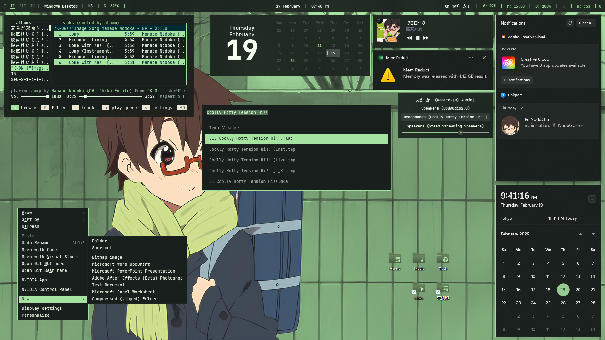
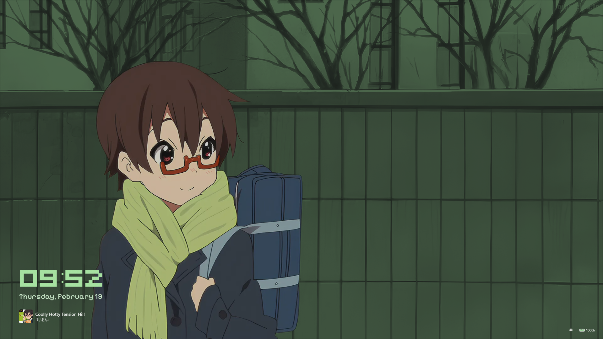
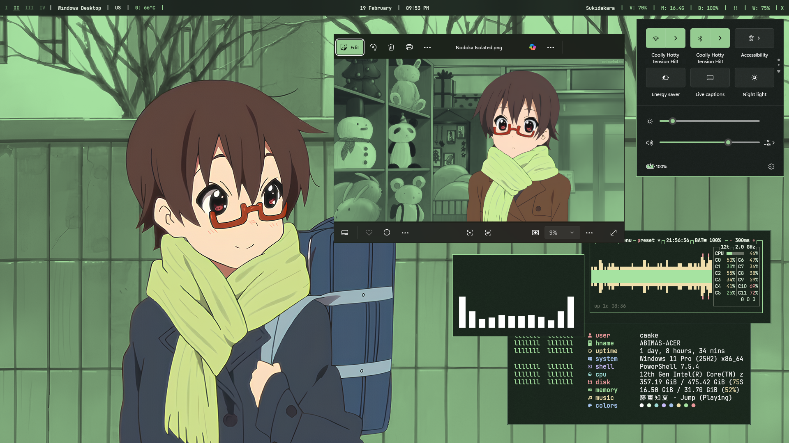
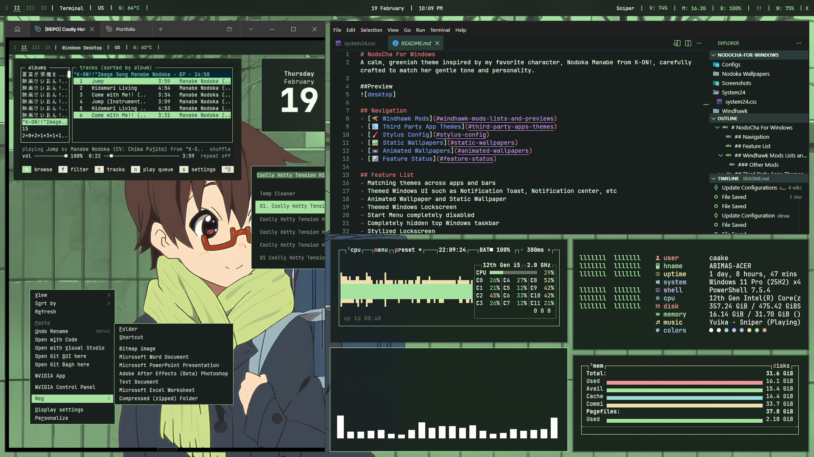
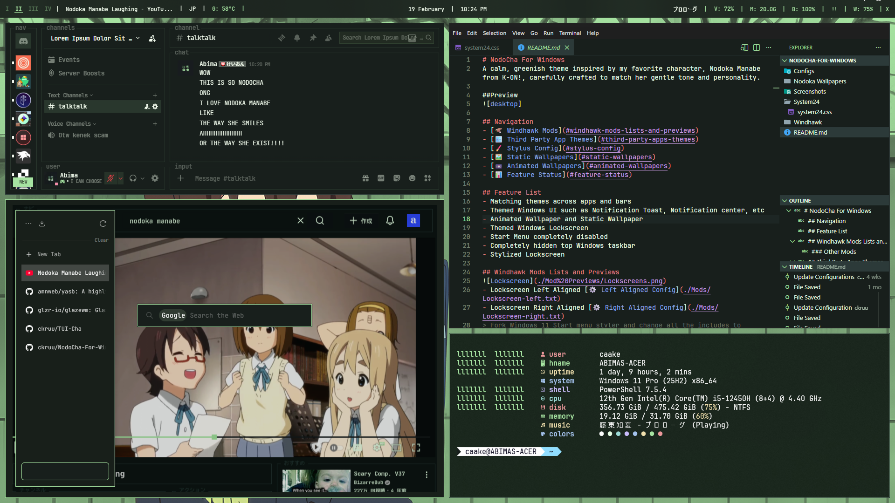
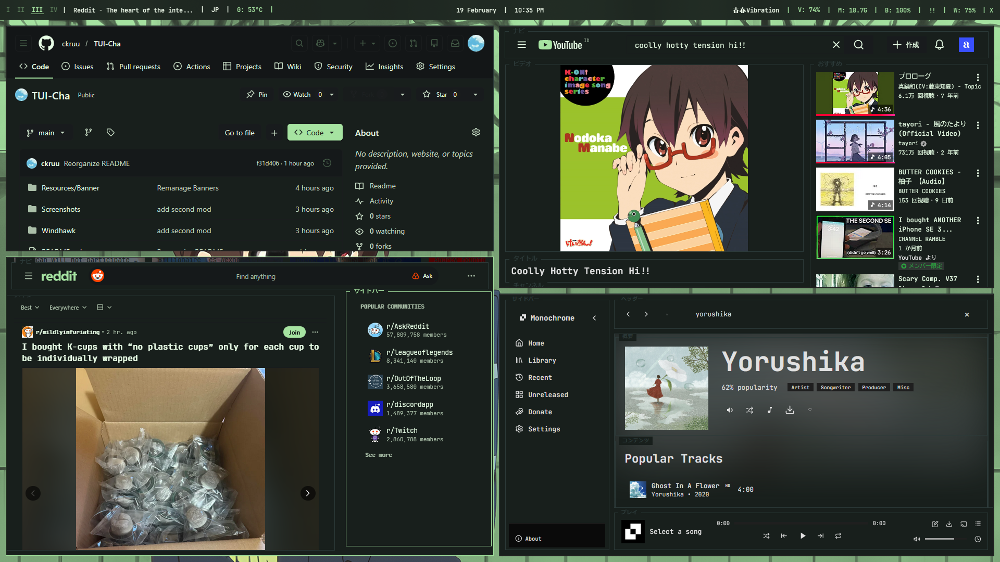

 

 

# TUI NodoCha
TUI Version of [NodoCha](https://github.com/ckruu/NodoCha-For-Windows)

> Please note this mostly is still work in progress, expect some modifications in the future.
> This setup was only tested on 1920 x 1080 monitor with 100% Scaling, expect things to break if you're planning on using this setup on another screen resolution or scaling.

[Windhawk Mods](google.com) •
[WM](google.com) •
[YASB](google.com) •
[Third-party Apps](google.com) •
[Stylus](google.com)

### Features

- Green focused theme
- Simple yet functional bar
- No distraction
- Calm and elegant, just like Nodoka

### Theme Status

| Apps                      | Websites                   |
| --------------------------|----------------------------|
| GlazeWM (💚)              | YouTube (🟢)               |
| YASB (💚)                 | Monochrome Music (🟢)      |
| VS Code (💚)              | DuckDuckGo (🔶)            |
| Discord (📗)              | Reddit (🔶)                |
| Telegram (🔶)             | Google (🗓️)                |
| Zen Browser (🔶)          | WhatsApp (🗓️)              |

## Windhawk Mods
 
     
    
    
 

#### 1. Lockscreen Styler (Start Menu Fork)
> Currently only on the left side.

[📜 Config](./Windhawk/Lockscreen.txt)

#### 2. Windows Notification Placement
> Will mess up when used in diffrent DPI and resolution.

[📜 Config](./Windhawk/NPlacement.txt)

#### 3. Windows 11 Taskbar Styler
> This will make your taskbar completely invisible, but it's still clickable.

[📜 Config](./Windhawk/Taskbar.txt)

#### 4. Windows 11 Start Menu Styler
> This will make your start menu and search menu invisible, and you cant use it.

[📜 Config](./Windhawk/Start.txt)

#### 5. Windows 11 Taskbar Styler
> This will make your taskbar completely invisible, but it's still clickable.

[📜 Config](./Windhawk/Taskbar.txt)

#### 6. Other Mods with no or minimal configurations
- Better file sizes in Explorer details
- Disable rounded corners in Windows 11
- Explorerframe fixes for Win11 22H2+
- Hide search bar
- Invisible Window borders
- No focus rectangle
- Remove command bar
- Taskbar on top for Windows 11
- Taskbar tray icon spacing and grid
> NotifIcoWidth 24, NotifIconRow 1, OverflowIconWidth 32, OvcerflowIconsPerRow 5
- Taskbar tray system icon tweaks
> Hides Volume, network, battery icon.
- Windows 7 Command bar

## Window Manager
 
    
 

Get [GlazeWM](https://github.com/glzr-io/glazewm) • [Config](./Desktop/GlazeWM/config.yaml)

## YASB
 
    
 

Get [YASB](https://github.com/amnweb/yasb) • [Config](./Desktop/YASB/config.yaml) • [Styles](./Desktop/YASB/styles.css)

## Third-party Apps
 
    
 

#### 1. Vesktop (Discord)
A custom modification of [System24](https://github.com/refact0r/system24) theme.

#### 2. Windows Terminal
Windows terminal with focus mode and [NodoCha](./Windhawk/WT.txt) theme.

#### 3. VS Code
WIP!

#### 4. Zen Browser
A custom modification of [Wireframe](https://github.com/SehajveerSingh2005/zen-wireframe-2.0).

#### 5. Rectify11 V4
> This also still work in progress, it is not recommended to install on your main machine.
Used [Rectify11](https://rectify11.net/home) to make Windows 11 more cconsistent. Use the [V4 Beta](https://discord.gg/gsgu9GCtsk) on their Discord channel for a newer version of Windows.

## Stylus
 

 
> This is a work in progress, some elements may appear unstyled or broken in diffrent scenarios, It also weirdly causes some website to perform poorly. Use at your own risk.

#### TUI-YouTube
> Has some unfinished pages and elements, and would lag or freeze sometimes, at certain resolution/browser size.
[TUI Tube](./Stylus/TUITube.txt)

#### Tui-Monochrome Music
> Has some dublicate styling applied, and some newly added feature isnt styled yet.
[Monochrome Samidy](./Stylus/Monochrome.txt)

#### TUI Reddit
> Still very early and unusable.
Coming soon!

#### TUI DuckDuckGo
> Also still very early to be usable.
Coming soon!